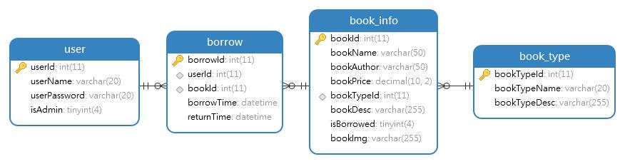

**需要完整代码可以加qq  931708230 或者加微信  ynwwxid**

**需要完整代码可以加qq  931708230 或者加微信  ynwwxid**

#程序员 #java #毕业设计 #图书管理系统 #springboot #课程设计 #编程 #Axios #MyBatis #vue #ElementUI #源代码 #javaWeb #ssm 
## 项目介绍

springboot的前后端分离的图书管理系统项目。

后端使用Java+SpringBoot+MyBatis+MySQL

前端使用Vue+Axios+Element UI

对应的后端文件夹如下：BookManager

对应的前端文件夹如下：BookManagerVue

前台功能：图书查询、图书借阅、图书归还、登录注册、修改密码

后台功能-管理员登录：图书管理、借阅信息管理、图书类型管理、用户管理

## 项目截图

### 数据库结构

## 演示地址

项目演示地址：http://localhost:8092/BookManager/

管理员账号`admin`，密码`admin`

读者账号`wangpeng`，密码`123456`

## 搭建步骤

### 后端程序

1、数据库导入，新建数据库student_manager，将`book_manager.sql`文件导入并运行。

2、打开项目，打开`src/main/resources/application.properties`，修改数据库和Redis的配置文件。

3、运行项目

## 环境介绍

### 基础环境 :IDEA，maven3.6，JDK 1.8 ， Mysql 5.7

## 项目描述

### 源码+数据库脚本 

所有项目以及源代码本人均调试运行无问题 可支持远程调试运行(需要加米)
	
**需要完整代码可以加qq  931708230 或者加微信 ynwwxid**

**需要完整代码可以加qq  931708230 或者加微信  ynwwxid**

